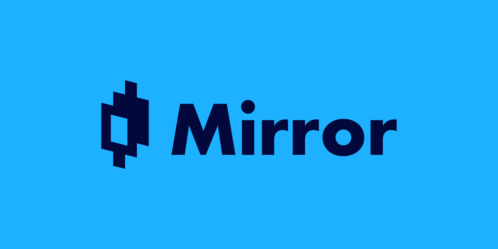

# Mirror Web App (Terra)

[![Add to Homescreen](https://img.shields.io/badge/Skynet-Add%20To%20Homescreen-00c65e?style=for-the-badge&labelColor=0d0d0d&logo=data:image/png;base64,iVBORw0KGgoAAAANSUhEUgAAACAAAAAbCAYAAAAdx42aAAAABGdBTUEAALGPC/xhBQAAACBjSFJNAAB6JgAAgIQAAPoAAACA6AAAdTAAAOpgAAA6mAAAF3CculE8AAAAeGVYSWZNTQAqAAAACAAFARIAAwAAAAEAAQAAARoABQAAAAEAAABKARsABQAAAAEAAABSASgAAwAAAAEAAgAAh2kABAAAAAEAAABaAAAAAAAAAEgAAAABAAAASAAAAAEAAqACAAQAAAABAAAAIKADAAQAAAABAAAAGwAAAADGhQ7VAAAACXBIWXMAAAsTAAALEwEAmpwYAAACZmlUWHRYTUw6Y29tLmFkb2JlLnhtcAAAAAAAPHg6eG1wbWV0YSB4bWxuczp4PSJhZG9iZTpuczptZXRhLyIgeDp4bXB0az0iWE1QIENvcmUgNi4wLjAiPgogICA8cmRmOlJERiB4bWxuczpyZGY9Imh0dHA6Ly93d3cudzMub3JnLzE5OTkvMDIvMjItcmRmLXN5bnRheC1ucyMiPgogICAgICA8cmRmOkRlc2NyaXB0aW9uIHJkZjphYm91dD0iIgogICAgICAgICAgICB4bWxuczp0aWZmPSJodHRwOi8vbnMuYWRvYmUuY29tL3RpZmYvMS4wLyIKICAgICAgICAgICAgeG1sbnM6ZXhpZj0iaHR0cDovL25zLmFkb2JlLmNvbS9leGlmLzEuMC8iPgogICAgICAgICA8dGlmZjpPcmllbnRhdGlvbj4xPC90aWZmOk9yaWVudGF0aW9uPgogICAgICAgICA8dGlmZjpSZXNvbHV0aW9uVW5pdD4yPC90aWZmOlJlc29sdXRpb25Vbml0PgogICAgICAgICA8ZXhpZjpQaXhlbFlEaW1lbnNpb24+NTM8L2V4aWY6UGl4ZWxZRGltZW5zaW9uPgogICAgICAgICA8ZXhpZjpQaXhlbFhEaW1lbnNpb24+NjQ8L2V4aWY6UGl4ZWxYRGltZW5zaW9uPgogICAgICAgICA8ZXhpZjpDb2xvclNwYWNlPjE8L2V4aWY6Q29sb3JTcGFjZT4KICAgICAgPC9yZGY6RGVzY3JpcHRpb24+CiAgIDwvcmRmOlJERj4KPC94OnhtcG1ldGE+Cnr0gvYAAAe5SURBVEgNlVYJbFzVFT3vL/Nt4yXOyiLahF24EMBrszqhNA1EpZWwK0qxZ2xk0apEpaJFNGkzRCC1VYlUJyoisj22EyrFlqBqaGgqiE0QxPaMSyi1E9JS0pRCwGRx7Njz5289702+lWArSZ8zkz/vv3vvufeee+8T+H9WT7WBVb2uEknVXw9XrENEWw6Bm5Hxr4bnz4IuxmHqHwHBu3D81xGYr6Cq5VMlE9ToEN3e+SbF+T8u+hwKD8SuhQjigKhFrp5Pw0CGOv0gAP9xX0CjWksHDA2wvc+51YqM+DWWtJ7E+U7I0xc1Gr4M4hpE3Ed//YPQtW3IMWZjNB1Q2oFpRJBDYz6Nu/zQJqMASD8nM9zgc5ElMOkeg+83oKLjdXQxErXZSFwaQHj4YOPj9GwLJh0a8tPINXMUviA4oEJtiEMQ+klGJwLH/RI0vZJpWAvLmIMztouIbihgtvcQlnT+PoxEFoD0RUDG78IVhivZ0Mhwt1AR403fCiIm0m4/Q76BHu3j3nRZqSn1vavgG+uZgifID4NR8glEYyRWUm6/jIRAqslE2Xa6xRV6K5/DsA/W3U6yDcILDBp0kR8x+LwVd7Wtl8doWmB7k4HiUz5qSgJ0DwnMKxGoHuKbc4RLNi6F8F8iiPmKH0I7gv9+Xob7/zgmsD82DznBQljeMBbvOKsMK82bqEAESEX3wtC/jnHHRlHEgu1uRVl71ngYIXV+hq8gEOiuNZnvDAaidzAFPSRlIQotjcR9ik78MpuCA9GFCLz76OFRLN35pylVAw21mGPtwvGzDolm0ts3UZZYwfcC8bj8yJRceg3VRFBCEIP1teTGLoIgWcW/6PTtmgrhV9uP4vSsFu7eTI8T6G8oU1p97Q2cSD8Pk9S2DJBcP1H7PXH9so1LAWlcRqu0o4uVsluVqCauQ8ZcwfIihDjL7N6tNpZ2biGIVkTwG7z7SAtOjzqoSPwAgbYEZzMbsff6pAKwKu4q4JInX1xyT/Lii2tkXpaoQmxjFYHNiqXrr7zwYE+cnY7KJaD7jz1PDnwHrtfMnP9C6ZOE9dKLyDwHlTs+nLLxdk0uNFZG1Ytnpvakjk0kJEhM2UPClWrKg595B3nGTeTBngsByEPZSpACAQZja5jubnLDIYN/isqOVqWnr24V336FzD6Mqp2vqbPJhuvgubfxnAthfIAl7YfV2fBLpqDgJqEq7q+xbvaRBzDhvjcdQFZAYKB+tepa8vdAbDfm563DyMQ7BLQB5W2vYs9DhZhtNDHY5eyOvTjhdmINq+jtugpKrCPARcg1jpBw+5Be1K8im9UNHKhrRlHOYzjr/Gc6gLDnpxq6oAUlmPDWYlnnMSSjD1O+g4ICo5k/09OnUdXeh75HFsDyfw5NW8Gg7YPjbEEZz8vyzvPr2Kq/hUAUM4ocTu4eHJ14CVfnbsZs6wmMOZ9OJ1HvSBZUxv2Yxm6Fpb2HwWgU5e07kPZvYTfsxdycb7CmDzAyu9iXC3Fn2w8Zzm8yOtfAMI8gFduPPHEnyjqew+LW5UhnHoXGP1NvxQ0FJ6HjUYxleDzInQ4A1dlAaeIjjPNQxs9HXiSBVP19WN55BK98eA9GJjdJirAx1VLZQRr8HTR/DItbamAHlaqBFUX2EuBxDrANnB+HCeRBfPJJEUn9JIF8QA5wWupD0wGMsIXKZRp/Z8uVdhwOGzkB7lb760ikisRmpmA1vTjEPOexT3wfuv4+gTwN3RhGadtKgvwafT6OK/OfQYH1GYF048r5y8grVlXiDtiZSkxMPDADB0gr2Rteq5uDIobfC66iR3LE/hunxhfjnu7RqflxuKEAY8E2vqtTtS3vABmflxH8CuWJbQpwdoRvxtzcG9jOOaKdvzH2L+L0+AtS13QAUiocSslYG1twjKTLzoG0sxHlHc8qAKUcPlPDRhG0me11lmqzBREg7R1C4MfpcZcCkow9TiI+ieKcBeoCM+mO8vzamQGEkzApS0rrYwpkWjSOUpvEqUYp2d/F/j5c4qpmI4H0P7yIfZ6AjWqmxuFtyOQzb0TuW5Ql8PZe9NTkoyB/E9PXhOLcQpxxvj0zAAk5LMdktAV5ZiNO2TYrwmJyPuPbNahoP6giVcNfg8Xa1EgfjP6MZfesVEHjLgksx7jk0h/geRsZkSH2mBL4uAZVHX+5CIBzXHjzu8W4Iqef6m7ktYogdItvTpOUj5GMO5Uh+RXOBdl2+6JVvKw2M9Tl9JadUWi4ghPNkawWz5GE2aEmB/6UgpkeQi6kordRUIaygDm2YQgrG16vl95uh+30Yp99AnFOvea1Fta/arONrybIXRw4c7MXVsjbtIlii/xwS3BXYljOnIsDkKDCATUQLWded9P4AvaHDA0LemUyGlLhKY7rf9AYicXce/5CVs+1NCzUJwg8Es5gY5NV8FuUJn7ElKhquzSA80G81fhltt0EvV/F/Eqms66YYCEiasbzuqfyLfuG4/OLd0BpOJ9VYXsTVPUUw98sVXJJ20R4uSskpTwvL6mB/2M2oFvP3f1p0KM6Bl36pTHn8gIjAaUdXvOCl8mHZ7Bs5/tZrsSl/7KyFAr5/+UtRbRzwnuY63kLZHe8lyAq6PFCNqM5LFabrfZjah7mXg8MYzdKW/+pDMxwh/wf4xZoOPPcKX0AAAAASUVORK5CYII=)](https://homeapp.hns.siasky.net/#/skylink/AQC2TDP2zSLBzMXFWg2FYYpXfUizHrIzg0S4pn6l-2TLfg)




**NOTE**: This repository contains the source code for the Terra Mirror Web App, located at https://terra.mirror.finance. For the Ethereum version, visit [here](https://github.com/mirror-protocol/terra-web-app).

The Mirror Web App is a web frontend for interacting with [Mirror Contracts](https://github.com/Mirror-Protocol/mirror-contracts). It is intended to be used with the [Terra Station Extension](https://terra.money/extension) plugin for Chromium browsers.

## Skynet portal URL

```
https://2009tnf1ojqq6b5fj5q72je656scv3j06bf5tjms9h48krvfk3fbqo0.siasky.net/#/trade
```
## HNS decentralized domain name

```
https://000abt.hns.siasky.net/#/trade
```

### Hackathon: Open DeFi Hackathon
Host Your Hack's Front-End On Skynet

1. [x] adding a working "Save to Homescreen" link in the Github repo (example) | 3 shares
2. [x] using an ENS or HNS decentralized domain name for the web app | 1 share
3. [x] use the Deploy to Skynet Github action for building and deploying your frontend automatically | 1 share
4. [ ] hosting off-chain, mutable application data on Skynet using SkyDB or MySky | 1 share

## Quick Installation & Start

```sh
npm install
npm run start
```
## Development on Skynet

This project was bootstrapped with [Create React App](https://github.com/facebook/create-react-app).

### Adding Skynet Action to Workflow

Please create a file in your code source “.github/workflows/deploy.yml” with the most basic workflow and add the following:

```
      - name: Deploy to Skynet
        uses: SkynetLabs/deploy-to-skynet-action@v2
        with:
          upload-dir: public
          github-token: ${{ secrets.GITHUB_TOKEN }}
          registry-seed: ${{ secrets.REGISTRY_SEED || '' }}
          registry-datakey: ${{ secrets.REGISTRY_DATAKEY || '' }}
```

source: https://docs.siasky.net/developer-guides/deploy-github-actions

### Changes to index.tsx (import HashRouter insted of ReactRouter)

```
import { HashRouter as Router } from "react-router-dom"
```
Hint: Gatsby & full React Router support coming soon

### Integrating with Homescreen

```
[![Add to Homescreen](https://img.shields.io/badge/Skynet-Add%20To%20Homescreen-00c65e?style=for-the-badge&labelColor=0d0d0d&logo=data:image/png;base64,iVBORw0KGgoAAAANSUhEUgAAACAAAAAbCAYAAAAdx42aAAAABGdBTUEAALGPC/xhBQAAACBjSFJNAAB6JgAAgIQAAPoAAACA6AAAdTAAAOpgAAA6mAAAF3CculE8AAAAeGVYSWZNTQAqAAAACAAFARIAAwAAAAEAAQAAARoABQAAAAEAAABKARsABQAAAAEAAABSASgAAwAAAAEAAgAAh2kABAAAAAEAAABaAAAAAAAAAEgAAAABAAAASAAAAAEAAqACAAQAAAABAAAAIKADAAQAAAABAAAAGwAAAADGhQ7VAAAACXBIWXMAAAsTAAALEwEAmpwYAAACZmlUWHRYTUw6Y29tLmFkb2JlLnhtcAAAAAAAPHg6eG1wbWV0YSB4bWxuczp4PSJhZG9iZTpuczptZXRhLyIgeDp4bXB0az0iWE1QIENvcmUgNi4wLjAiPgogICA8cmRmOlJERiB4bWxuczpyZGY9Imh0dHA6Ly93d3cudzMub3JnLzE5OTkvMDIvMjItcmRmLXN5bnRheC1ucyMiPgogICAgICA8cmRmOkRlc2NyaXB0aW9uIHJkZjphYm91dD0iIgogICAgICAgICAgICB4bWxuczp0aWZmPSJodHRwOi8vbnMuYWRvYmUuY29tL3RpZmYvMS4wLyIKICAgICAgICAgICAgeG1sbnM6ZXhpZj0iaHR0cDovL25zLmFkb2JlLmNvbS9leGlmLzEuMC8iPgogICAgICAgICA8dGlmZjpPcmllbnRhdGlvbj4xPC90aWZmOk9yaWVudGF0aW9uPgogICAgICAgICA8dGlmZjpSZXNvbHV0aW9uVW5pdD4yPC90aWZmOlJlc29sdXRpb25Vbml0PgogICAgICAgICA8ZXhpZjpQaXhlbFlEaW1lbnNpb24+NTM8L2V4aWY6UGl4ZWxZRGltZW5zaW9uPgogICAgICAgICA8ZXhpZjpQaXhlbFhEaW1lbnNpb24+NjQ8L2V4aWY6UGl4ZWxYRGltZW5zaW9uPgogICAgICAgICA8ZXhpZjpDb2xvclNwYWNlPjE8L2V4aWY6Q29sb3JTcGFjZT4KICAgICAgPC9yZGY6RGVzY3JpcHRpb24+CiAgIDwvcmRmOlJERj4KPC94OnhtcG1ldGE+Cnr0gvYAAAe5SURBVEgNlVYJbFzVFT3vL/Nt4yXOyiLahF24EMBrszqhNA1EpZWwK0qxZ2xk0apEpaJFNGkzRCC1VYlUJyoisj22EyrFlqBqaGgqiE0QxPaMSyi1E9JS0pRCwGRx7Njz5289702+lWArSZ8zkz/vv3vvufeee+8T+H9WT7WBVb2uEknVXw9XrENEWw6Bm5Hxr4bnz4IuxmHqHwHBu3D81xGYr6Cq5VMlE9ToEN3e+SbF+T8u+hwKD8SuhQjigKhFrp5Pw0CGOv0gAP9xX0CjWksHDA2wvc+51YqM+DWWtJ7E+U7I0xc1Gr4M4hpE3Ed//YPQtW3IMWZjNB1Q2oFpRJBDYz6Nu/zQJqMASD8nM9zgc5ElMOkeg+83oKLjdXQxErXZSFwaQHj4YOPj9GwLJh0a8tPINXMUviA4oEJtiEMQ+klGJwLH/RI0vZJpWAvLmIMztouIbihgtvcQlnT+PoxEFoD0RUDG78IVhivZ0Mhwt1AR403fCiIm0m4/Q76BHu3j3nRZqSn1vavgG+uZgifID4NR8glEYyRWUm6/jIRAqslE2Xa6xRV6K5/DsA/W3U6yDcILDBp0kR8x+LwVd7Wtl8doWmB7k4HiUz5qSgJ0DwnMKxGoHuKbc4RLNi6F8F8iiPmKH0I7gv9+Xob7/zgmsD82DznBQljeMBbvOKsMK82bqEAESEX3wtC/jnHHRlHEgu1uRVl71ngYIXV+hq8gEOiuNZnvDAaidzAFPSRlIQotjcR9ik78MpuCA9GFCLz76OFRLN35pylVAw21mGPtwvGzDolm0ts3UZZYwfcC8bj8yJRceg3VRFBCEIP1teTGLoIgWcW/6PTtmgrhV9uP4vSsFu7eTI8T6G8oU1p97Q2cSD8Pk9S2DJBcP1H7PXH9so1LAWlcRqu0o4uVsluVqCauQ8ZcwfIihDjL7N6tNpZ2biGIVkTwG7z7SAtOjzqoSPwAgbYEZzMbsff6pAKwKu4q4JInX1xyT/Lii2tkXpaoQmxjFYHNiqXrr7zwYE+cnY7KJaD7jz1PDnwHrtfMnP9C6ZOE9dKLyDwHlTs+nLLxdk0uNFZG1Ytnpvakjk0kJEhM2UPClWrKg595B3nGTeTBngsByEPZSpACAQZja5jubnLDIYN/isqOVqWnr24V336FzD6Mqp2vqbPJhuvgubfxnAthfIAl7YfV2fBLpqDgJqEq7q+xbvaRBzDhvjcdQFZAYKB+tepa8vdAbDfm563DyMQ7BLQB5W2vYs9DhZhtNDHY5eyOvTjhdmINq+jtugpKrCPARcg1jpBw+5Be1K8im9UNHKhrRlHOYzjr/Gc6gLDnpxq6oAUlmPDWYlnnMSSjD1O+g4ICo5k/09OnUdXeh75HFsDyfw5NW8Gg7YPjbEEZz8vyzvPr2Kq/hUAUM4ocTu4eHJ14CVfnbsZs6wmMOZ9OJ1HvSBZUxv2Yxm6Fpb2HwWgU5e07kPZvYTfsxdycb7CmDzAyu9iXC3Fn2w8Zzm8yOtfAMI8gFduPPHEnyjqew+LW5UhnHoXGP1NvxQ0FJ6HjUYxleDzInQ4A1dlAaeIjjPNQxs9HXiSBVP19WN55BK98eA9GJjdJirAx1VLZQRr8HTR/DItbamAHlaqBFUX2EuBxDrANnB+HCeRBfPJJEUn9JIF8QA5wWupD0wGMsIXKZRp/Z8uVdhwOGzkB7lb760ikisRmpmA1vTjEPOexT3wfuv4+gTwN3RhGadtKgvwafT6OK/OfQYH1GYF048r5y8grVlXiDtiZSkxMPDADB0gr2Rteq5uDIobfC66iR3LE/hunxhfjnu7RqflxuKEAY8E2vqtTtS3vABmflxH8CuWJbQpwdoRvxtzcG9jOOaKdvzH2L+L0+AtS13QAUiocSslYG1twjKTLzoG0sxHlHc8qAKUcPlPDRhG0me11lmqzBREg7R1C4MfpcZcCkow9TiI+ieKcBeoCM+mO8vzamQGEkzApS0rrYwpkWjSOUpvEqUYp2d/F/j5c4qpmI4H0P7yIfZ6AjWqmxuFtyOQzb0TuW5Ql8PZe9NTkoyB/E9PXhOLcQpxxvj0zAAk5LMdktAV5ZiNO2TYrwmJyPuPbNahoP6giVcNfg8Xa1EgfjP6MZfesVEHjLgksx7jk0h/geRsZkSH2mBL4uAZVHX+5CIBzXHjzu8W4Iqef6m7ktYogdItvTpOUj5GMO5Uh+RXOBdl2+6JVvKw2M9Tl9JadUWi4ghPNkawWz5GE2aEmB/6UgpkeQi6kordRUIaygDm2YQgrG16vl95uh+30Yp99AnFOvea1Fta/arONrybIXRw4c7MXVsjbtIlii/xwS3BXYljOnIsDkKDCATUQLWded9P4AvaHDA0LemUyGlLhKY7rf9AYicXce/5CVs+1NCzUJwg8Es5gY5NV8FuUJn7ElKhquzSA80G81fhltt0EvV/F/Eqms66YYCEiasbzuqfyLfuG4/OLd0BpOJ9VYXsTVPUUw98sVXJJ20R4uSskpTwvL6mB/2M2oFvP3f1p0KM6Bl36pTHn8gIjAaUdXvOCl8mHZ7Bs5/tZrsSl/7KyFAr5/+UtRbRzwnuY63kLZHe8lyAq6PFCNqM5LFabrfZjah7mXg8MYzdKW/+pDMxwh/wf4xZoOPPcKX0AAAAASUVORK5CYII=)](https://homeapp.hns.siasky.net/#/skylink/[skylink])
```
You'll want to add the following code in your project's Readme, replacing [skylink]with your resolver skylink (excluding sia://).

### Using handshake domain

1. [x] open an account on namebase using my referral link https://www.namebase.io/register/kyohwp
2. [x] refer to namebase discord and DM @johnnywu with your wallet address and e-mailfor free HNS tokens and free HNS domain
3. [x] Back to Domain Manager at your namebase account and add a blockchain DNS record with your sia link
4. [ ] hosting off-chain, mutable application data on Skynet using SkyDB or MySky | 1 share
## License

This software is licensed under the Apache 2.0 license. Read more about it [here](./LICENSE).

© 2020 Mirror Protocol
